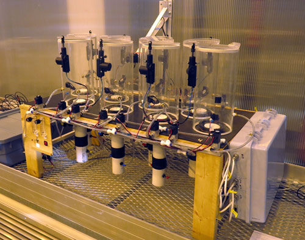

# A low-cost, automated, closed gas exchange system

This directory includes documentation for an automated closed gas exchange system for whole-plant C flux measurements, built at Syracuse University in 2018. 

  

**Citation**: Fridley et al. Metabolic scaling of roots and shoots: integrating power-law mass-flux relationships into studies of whole-plant carbon allocation (**forthcoming**).

Documentation includes:
- [Summary description](Description.md)
- Design schematics
  - Top (shoot chambers and solenoids)
  - Bottom (root chambers and solenoids)
- Parts list and prices
- [R control code](R-Gasman-interface5.R)
